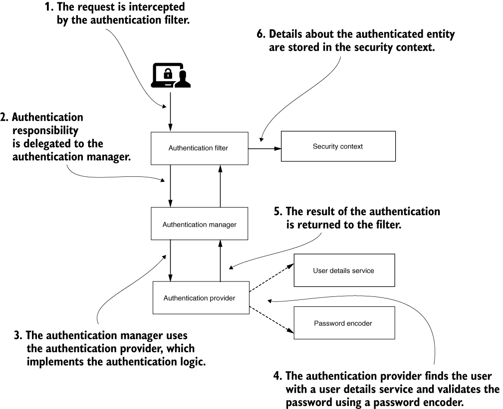
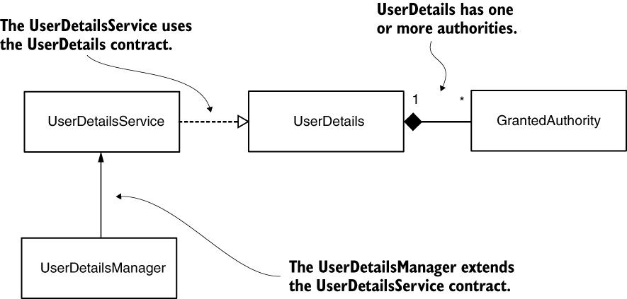
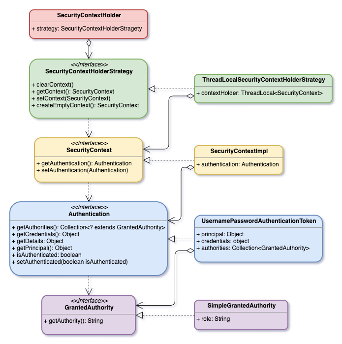

# JWT
O objetivo desse repositório é criar o backend de um Blog com mecanismos de autenticação
e autorização via [json web tokens](https://jwt.io/)

Serão disponibilizados endpoints para 
- Cadastrar usuários
- Autenticar usuários
- Incluir, excluir alterar e detalhar posts
- Incluir, excluir alterar comentários nos posts

#### Passos necessários para execução da aplicação:
1. Clone o repositório
2. Execute o comando: ./mvnw spring-boot:run
3. O microsserviço de cadastro de usuário estará acessível em 
http://localhost:8080/api/auth/signup

#### Tecnologias
- Spring Boot
- Spring Data
- Spring REST
- Spring Security

 O esquema geral de [autenticação](https://livebook.manning.com/book/spring-security-in-action/chapter-2/section-2-2?origin=product-toc) por meio do Spring Security é o seguinte:

 É no [SecurityContextHolder](https://docs.spring.io/spring-security/site/docs/current/reference/html5/#servlet-authentication-securitycontextholder) que o Spring guarda os detalhes de quem está autenticado:

 O AuthenticationProvider implementa a lógica de autenticação e delega o gerenciamento de usuários e senhas
ao UserDetailsService e PasswordEncoder

 É a interface [UserDetail](https://livebook.manning.com/concept/spring/userdetails-contract) que provê ao sistema as informações básicas sobre os usuários. Implementações dessa interface guardam informações que serão posteriormente encapsuladas em objeto do tipo Authentication

 Essas implementações **não são usadas diretamente pelo Spring para fins de segurança**, o que permite
que outras informações não relacionadas à segurança (telefone, email, etc.) sejam concentradas no mesmo lugar.

As relações entre as [interfaces e classes](https://waynestalk.com/en/spring-security-architecture-explained-en/) que participam do processo de autenticação são as seguintes:

   
**Este projeto ainda está em desenvolvimento**

