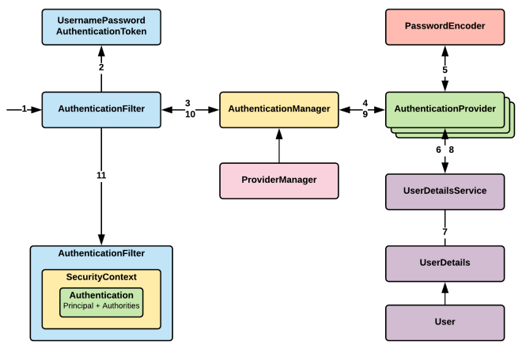
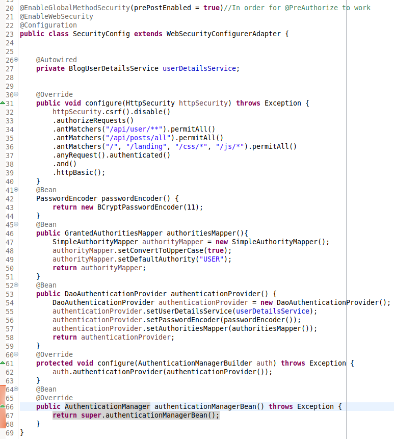
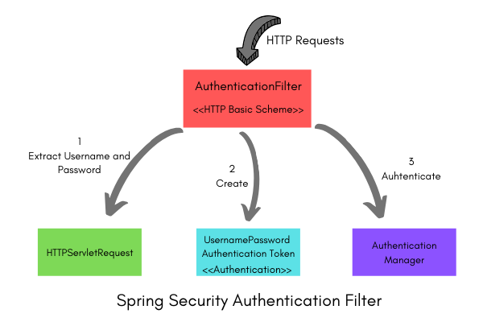
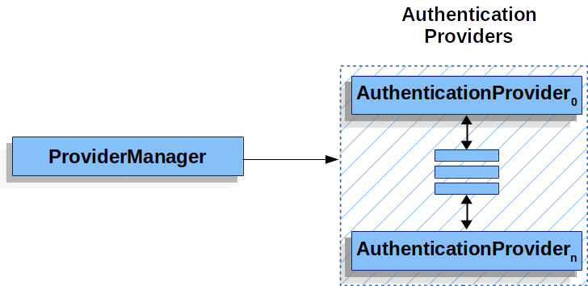
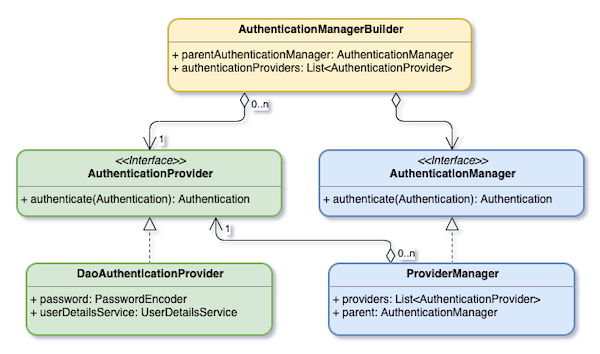
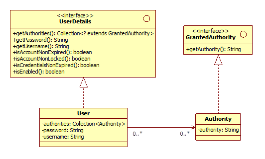
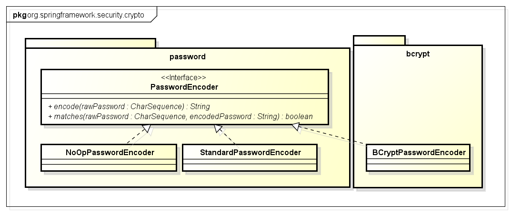
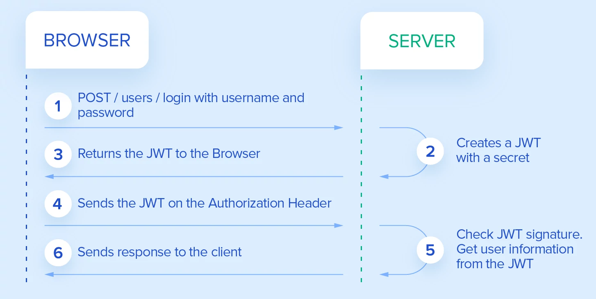
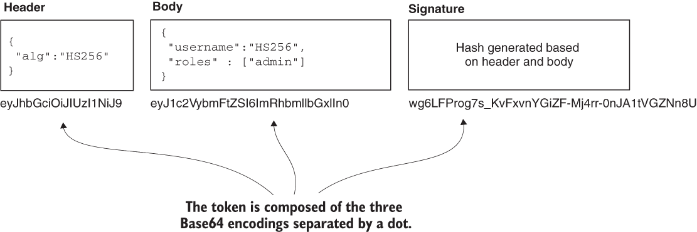
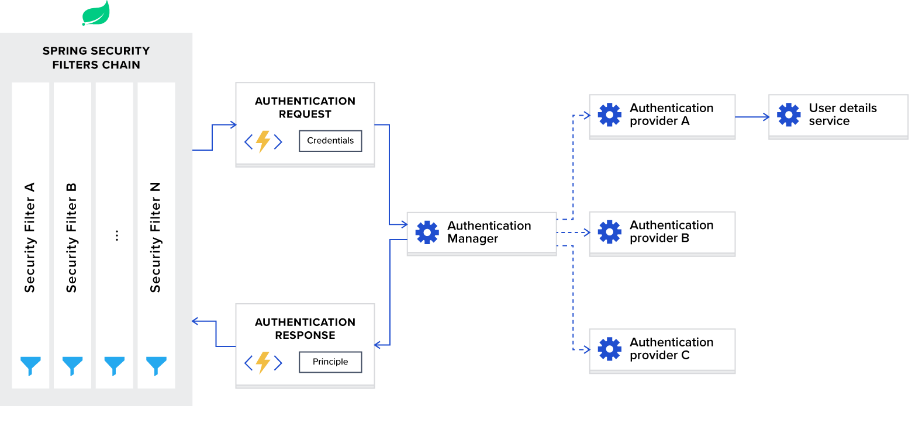

# JWT
O objetivo desse repositório é criar o backend de um Blog com mecanismos de autenticação
e autorização via [json web tokens](https://jwt.io/)

Serão disponibilizados endpoints para 
- Cadastrar usuários
- Autenticar usuários
- Incluir, excluir alterar e detalhar posts
- Incluir, excluir alterar comentários nos posts

#### Passos necessários para execução da aplicação:
1. Clone o repositório
2. Execute o comando: ./mvnw spring-boot:run
3. O microsserviço de cadastro de usuário estará acessível em 
http://localhost:8080/api/public/signup

#### Tecnologias
- Spring Boot
- Spring Data
- Spring REST
- Spring Security

#### Autenticação
O fluxo de [autenticação](https://livebook.manning.com/book/spring-security-in-action/chapter-2/section-2-2?origin=product-toc) por meio do Spring Security é o seguinte: 

 Tendo em vista essa cadeia de dependências, a cofiguração do processo de autenticação por meio do Spring Security deverá obedecer a seguinte sequência:

1. Definir uma classe que implemente a interface UserDetails
2. Definir uma classe que implemente a interface UserDetailsService
3. Definir a lógica de criptografia de senha ou utilizar uma implementação da interface PasswordEncoder fornecida pelo Spring Security
4. Definir a lógica de autenticação a ser implementada ou utilizar uma implementação da interface AuthenticationProvider disponibilizada pelo Spring Security
5. Implementar a interface AuthenticationManager ou utilizar uma implementação dessa interface construída por meio da classe [AuthenticationManagerBuilder](https://docs.spring.io/spring-security/site/docs/4.0.x/apidocs/org/springframework/security/config/annotation/authentication/builders/AuthenticationManagerBuilder.html).

Após a configuração do Spring Security, é possível adicionar o AuthenticationManager como um bean ao contexto da aplicação por meio do método [authenticationManagerBean()](https://docs.spring.io/spring-security/site/docs/4.0.x/apidocs/org/springframework/security/config/annotation/web/configuration/WebSecurityConfigurerAdapter.html#authenticationManagerBean--) da classe [WebSecurityConfigurerAdapter](https://docs.spring.io/spring-security/site/docs/4.0.x/apidocs/org/springframework/security/config/annotation/web/configuration/WebSecurityConfigurerAdapter.html)

 O processo de [autenticação](https://docs.spring.io/spring-security/site/docs/current/reference/html5/#servlet-authentication-authentication) tem dois objetivos no Spring Security:

- Prover ao AuthenticationManager as credenciais fornecidas pelo usuário para se autenticar
- Representar o usuário autenticado por meio da interface [Authentication](https://docs.spring.io/spring-security/site/docs/5.5.1/api/org/springframework/security/core/Authentication.html), que pode ser obtida a partir do  SecurityContext: SecurityContextHolder.getContext().getAuthentication() 

 A interface [Authentication](https://docs.spring.io/spring-security/site/docs/5.5.1/api/org/springframework/security/core/Authentication.html) dispõe de métodos para obter:

- **authorities**, que são permissões em alto nível atribuídas ao usuário, como papéis ou escopos. Permissões são definidas por Strings e, por padrão, prefixadas com 'ROLE_'
- **credentials**, geralmente uma senha, mas também pode ser um token.
- **principal**, que identifica o usuário. É geralmente uma implementação da interface [UserDetails](https://docs.spring.io/spring-security/site/docs/current/api/org/springframework/security/core/userdetails/UserDetails.html) quando se autentica com usuário e senha

#### Authentication Filter
A [primeira etapa](https://2darray.com/featured/spring-security-architecture-authentication/) deste processo ocorre no **Spring Security Authentication Filter**, que tem três responsabilidades:

1. Extrair o usuário e a senha que foram fornecidos para autenticação
2. Criar um [token](https://docs.spring.io/spring-security/site/docs/current/api/org/springframework/security/authentication/UsernamePasswordAuthenticationToken.html) de autenticação usando  _**UsernamePasswordAuthenticationToken**_, que é uma implementação da interface [Authentication](https://docs.spring.io/spring-security/site/docs/5.5.1/api/org/springframework/security/core/Authentication.html)
3. Delegar a continuação do processo de autenticação à interface _**AuthenticationManager**_, reponsável por analisar o token de autenticação e decidir se é uma credencial válida. 

 

#### AuthenticationManager
A [principal interface](https://spring.io/guides/topicals/spring-security-architecture) da estratégia de autenticação do Spring Security é [AuthenticationManager](https://docs.spring.io/spring-security/site/docs/4.2.15.RELEASE/apidocs/org/springframework/security/authentication/AuthenticationManager.html), cujo único método (authenticate( )) pode fazer uma das seguintes coisas:

1. Retornar uma [Authentication](https://docs.spring.io/spring-security/site/docs/5.5.1/api/org/springframework/security/core/Authentication.html) se puder ser verificado que as credenciais apresentadas são válidas.
2. Jogar uma exceção **AuthenticationException** se as credenciais apresentadas não forem válidas.
3. Retornar null, se ela não conseguir decidir.

 

 A implementação mais comum do AuthenticationManager é o [ProviderManager](https://docs.spring.io/spring-security/site/docs/current/reference/html5/#servlet-authentication-providermanager), que possui uma lista de AuthenticationProviders aos quais é dada a oportunidade de indicar se a autenticação deveria ter sucesso, falhar ou indicar que não consegue decidir e deixar essa tarefa para o próximo AuthenticationProvider da lista. 

 Também é possível [obter rapidamente](https://spring.io/guides/topicals/spring-security-architecture) o AuthenticationManager padrão por meio do [AuthenticationManagerBuilder](https://docs.spring.io/spring-security/site/docs/4.2.3.RELEASE/apidocs/index.html?org/springframework/security/config/annotation/authentication/builders/AuthenticationManagerBuilder.html) 

 

#### AuthenticationProvider
O AuthenticationProvider [implementa a lógica de autenticação](https://livebook.manning.com/book/spring-security-in-action/chapter-5/59) e delega o gerenciamento de usuários e senhas às interfaces UserDetailsService e PasswordEncoder, ambas definidas na classe de configuração do projeto.  

#### UserDetailService
A interface [UserDetailsService](https://docs.spring.io/spring-security/site/docs/3.2.x/apidocs/org/springframework/security/core/userdetails/UserDetailsService.html) possui um único método que deve ser implementado conforme a lógica do sistema e [retornar](https://www.javadevjournal.com/spring-security/spring-security-authentication/) um objeto que implementa a interface [UserDetails](https://docs.spring.io/spring-security/site/docs/current/api/org/springframework/security/core/userdetails/UserDetails.html) 

#### UserDetails
É a interface [UserDetails](https://livebook.manning.com/concept/spring/userdetails-contract) que provê ao sistema as informações básicas sobre os usuários. Implementações dessa interface guardam informações que serão posteriormente encapsuladas em objeto que implementa a interface Authentication. 

 Essas implementações **não são usadas diretamente pelo Spring para fins de segurança**, o que permite
 que outras informações não relacionadas à segurança (telefone, email, etc.) sejam concentradas no mesmo lugar.
 
  Neste projeto, o _design pattern_ [Decorator](https://en.wikipedia.org/wiki/Decorator_pattern) será utilizado na implementação da interface UserDetails 

#### Password Encoder
A interface [PasswordEncoder](https://docs.spring.io/spring-security/site/docs/5.0.0.M5/api/org/springframework/security/crypto/password/PasswordEncoder.html) possui dois métdodos abstratos, _**encode**_ e _**matches**_, que são autoexplicativos:

#### SecurityContext
É no [SecurityContextHolder](https://docs.spring.io/spring-security/site/docs/current/reference/html5/#servlet-authentication-securitycontextholder) que o Spring guarda os detalhes de quem está autenticado: 

 Os relacionamentos entre as [interfaces e classes](https://waynestalk.com/en/spring-security-architecture-explained-en/) que participam do processo de autenticação são os seguintes: 

 A codificação deste projeto observará os padrões de código fonte do [Spring Framework Code Style Guide](https://github.com/spring-projects/spring-framework/wiki/Code-Style). 

#### Autorização
O framework SpringSecurity provê suporte aos seguintes tipos de autorização

- Web request

#### JSON Web Tokens
RESTful API's são, por definição, stateless, ou seja, não guardam o estado entre uma requisição e outra.

Para superar o problema de ter que enviar o usuário e senha a cada requisição, a aplicaçao pode retornar ao usuário
uma string criptografada, um token, após a autenticação, que [será adicionado ao cabeçalho HTTP nas requisições
subsequentes](https://www.toptal.com/java/rest-security-with-jwt-spring-security-and-java)

.

O JWT é um padrão [RFC-7519](https://datatracker.ietf.org/doc/html/rfc7519) de mercado que define como transmitir e armazenar objetos JSON de forma compacta e segura entre diferentes aplicações

Um JSON Web Token (JWT) nada mais é do que uma forma compacta de reprentar uma série de claims, acompanhados de uma assinatura para verificar a sua autenticidade

Um token JWT tem [3 partes](https://livebook.manning.com/book/spring-security-in-action/chapter-11/77), Header, Payload e Signature, separadas por um ponto.

O **Header** armazena informações referentes ao Token. Por convenção, o token JWT é enviado no header **Authorization** utilizando o [esquema Bearer](https://swagger.io/docs/specification/authentication/bearer-authentication/)

O **Payload** (ou Body) é um objeto JSON com as Claims (informações) da entidade tratada, normalmente informações utilizadas para autenticação. Como o JWT utiliza o formato JSON, [cada _claim_ é uma chave do objeto JSON](https://github.com/jwtk/jjwt#overview).

Essas claims podem ser de [2 tipos](https://auth0.com/docs/tokens/json-web-tokens/json-web-token-claims):

1. Reserved claims: atributos não obrigatórios (mas recomendados) que são usados na validação do token pelos protocolos de segurança das APIs.
2. Custom claims: atributos que usamos em nossas aplicações. Normalmente armazenamos as informações do usuário autenticado na aplicação.

A assinatura (**Signature**) é a concatenação dos hashes gerados a partir do Header e Payload usando base64UrlEncode, com uma chave secreta ou certificado RSA, o que garante que o token não foi modificado.

Na arquitetura REST, a autenticação de difere das implementações da arquitetura monolito na medida em que o servidor REST autentica **todas** as requisições por meio dos dados disponíveis na requisição, ou seja, no token JWT. Se a autenticação falhar, o servidor devolve um HTTP code 401 (Unauthorized), mas se a autenticação for bem sucedida, o servidor continua com a execução da requisição e retorna um HTTP code 200 (OK).

#### Filtros
O Spring Securit é baseado em [filtros](https://www.toptal.com/spring/spring-security-tutorial). Quando um cliente manda uma requisição para a aplicação, o container decide qual filtro e qual servlet atenderão a requisição com base no caminho da URI:

Note que o Spring Security é ele mesmo um [filtro](https://spring.io/guides/topicals/spring-security-architecture) que delega o processamento das requisições aos seus filtros internos.

#### OAuth 2

   
**Este projeto ainda está em desenvolvimento**

